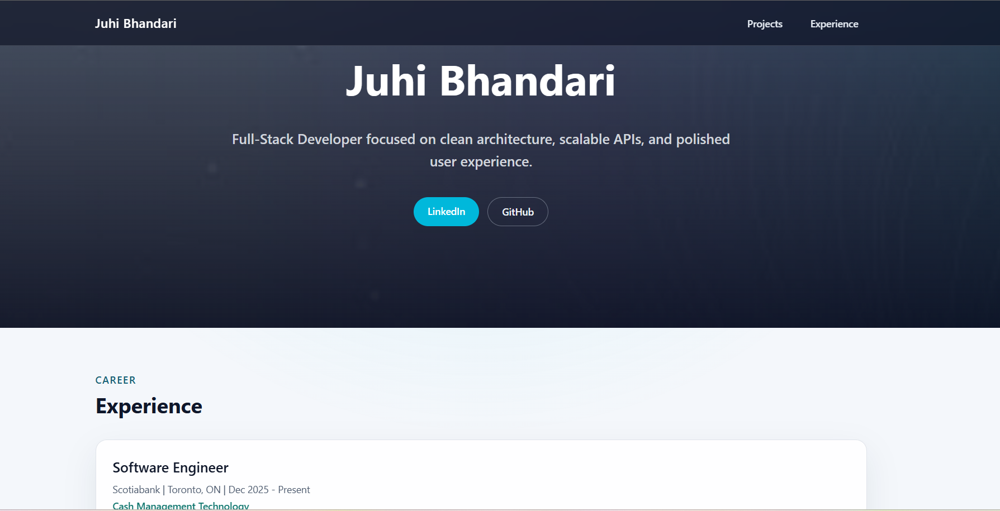
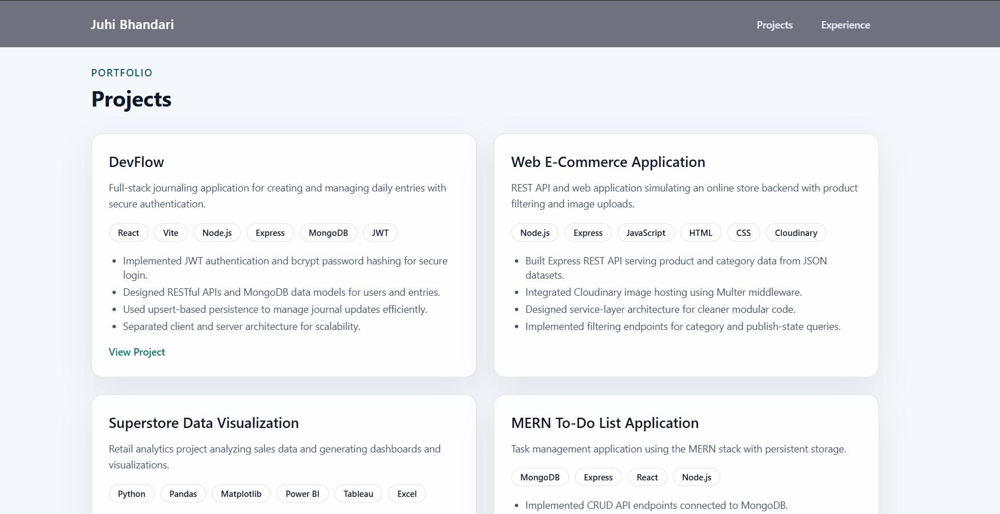

# Juhi Bhandari — Portfolio

[](https://nextjs.org/)  
[](https://react.dev/)  
[](https://www.typescriptlang.org/)  
[](https://tailwindcss.com/)  
[](https://pages.github.com/)

A modern **developer portfolio website** built using **Next.js, TypeScript, and TailwindCSS** to showcase my projects, experience, and technical skills.

🌐 **Live Website**  
https://jabhandari.github.io/PersonalWebsite/

---

## Table of Contents

- [Preview](#preview)
- [About the Project](#about-the-project)
- [Tech Stack](#tech-stack)
- [Features](#features)
- [Project Structure](#project-structure)
- [Running Locally](#running-locally)
- [Deployment](#deployment)
- [GitHub Stats](#github-stats)
- [Author](#author)
- [Future Improvements](#future-improvements)

---

## Preview





---

## About the Project

This portfolio website highlights:

- Professional experience
- Software development projects
- Links to GitHub and LinkedIn
- A responsive and modern UI
- Clean component-based architecture

The site is **statically generated using Next.js** and deployed via **GitHub Pages**.

---

## Tech Stack

| Technology | Purpose |
|------------|---------|
| Next.js | React framework used for building the application |
| React | UI component library |
| TypeScript | Type safety and improved developer experience |
| TailwindCSS | Utility-first styling framework |
| GitHub Pages | Hosting and deployment |
| pnpm | Package manager |

---

## Features

- Modern responsive UI
- Hero landing section
- Project showcase cards
- Experience timeline
- JSON-based content system
- Static site generation for fast performance
- GitHub Pages deployment

---

## Project Structure

```text
app/
  layout.tsx
  page.tsx
  globals.css

components/
  Hero.tsx
  Experience.tsx
  ExperienceCards.tsx
  Projects.tsx
  ProjectsCard.tsx

data/
  experience.json
  projects.json

public/
  images.jpg

next.config.ts
package.json
```

---

## Running Locally

Clone the repository:

```bash
git clone https://github.com/jabhandari/PersonalWebsite.git
cd PersonalWebsite/my-app
```

Install dependencies:

```bash
pnpm install
```

Run the development server:

```bash
pnpm dev
```

Open in your browser:

```text
http://localhost:3000
```

---

## Deployment

This site is deployed using **GitHub Pages**.

Run the deploy command:

```bash
pnpm run deploy
```

This command:

1. Builds the Next.js project
2. Exports static files
3. Publishes them to the `gh-pages` branch

GitHub Pages then serves the site from:

```text
https://jabhandari.github.io/PersonalWebsite/
```

---


## Author

**Juhi Bhandari**  

- GitHub: https://github.com/jabhandari
- LinkedIn: https://www.linkedin.com/in/juhi-bhandari-4baa61261/

---

## Future Improvements

- Dark / Light theme toggle
- Blog section
- Animated UI interactions
- GitHub activity integration
- Project filtering by tech stack